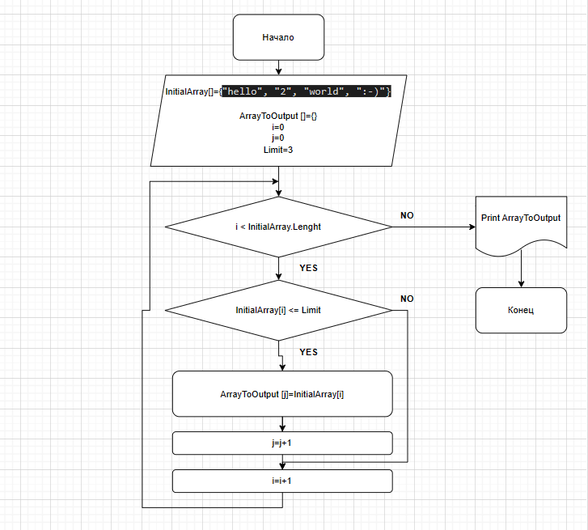

# ИТОГОВАЯ ПРОВЕРОЧНАЯ РАБОТА

## Задача : 
### Написать программу, которая из имеющегося массива строк формирует массив из строк, длина которых меньше либо равна 3 символа.
### Первоначальный массив можно ввести с клавиатуры, либо задать на старте выполнения алгоритма.
### При решение не рекомендуется пользоваться коллекциями, лучше обойтись исключительно массивами
### Написать программу, которая из имеющегося массива строк формирует массив из строк, длина которых меньше либо равна 3 символа. Первоначальный массив можно ввести с клавиатуры, либо задать на старте выполнения алгоритма. При решение не рекомендуется пользоваться коллекциями, лучше обойтись исключительно массивами

### Примеры:
["hello", "2", "world", ":-)"] --> ввод

["2",":-)"] --> вывод

### 1. Блок-Схема Решения

Файл с Блок-Схемой называется FinalTaskSchemePrintScreen.png

### 2. Программный Код Решения
Программный код рещения указан в файлу Program.cs в папке TaskCode

            using System;

internal class Program
{
    private static void Main(string[] args)
    {
        int sizeArrayToOutput = 0;

        int Limit = 3;
        string[] InitialArray = { "hello", "2", "world", ":-)" };
        PrintArray(InitialArray);
        Console.Write(" -> ");
        string[] tempArray = new string[InitialArray.Length];
        tempArray = SelectFromArray(InitialArray, Limit);

        string[] ArrayToOutput = new string[sizeArrayToOutput];
        ArrayToOutput = TruncateArray(tempArray, sizeArrayToOutput);
        PrintArray(ArrayToOutput);

        string[] SelectFromArray(string[] InitialArray, int length)
        {
            string[] tempArray = new string[InitialArray.Length];
            int j = 0;
            foreach (var item in InitialArray)
            {
                if (item.Length <= length)
                {
                    tempArray[j++] = item;
                }
            }
            sizeArrayToOutput = j;
            return tempArray;
        }

        string[] TruncateArray(string[] InitialArray, int count)
        {
            string[] tempArray = new string[count];
            int i = 0;
            while (i < count) tempArray[i] = InitialArray[i++];
            return tempArray;
        }

        void PrintArray(string[] array)
        {
                Console.Write("[");
        int count = 0;
        while (count < array.Length)
        {
            if (count < array.Length - 1)
            {
                Console.Write($"\"{array[count]}\", ");
            }
            else
            {
                Console.Write($"\"{array[count]}\"");
            }
            count++;
        }
        Console.Write("]");
    }
}
}

### 3. Описание решения
Выборка строк массива длиной не более 3 выполнена с использованием метода SelectFromArray. Заполнение итогового массива по заданию выполнено методом TruncateArray. Для вывода конечного массива использован метод PrintArray. В качестве ограничивающей переменной выступает  переменная"Limit", в качестве индексов использованы "i" и "j".

С Уважением,